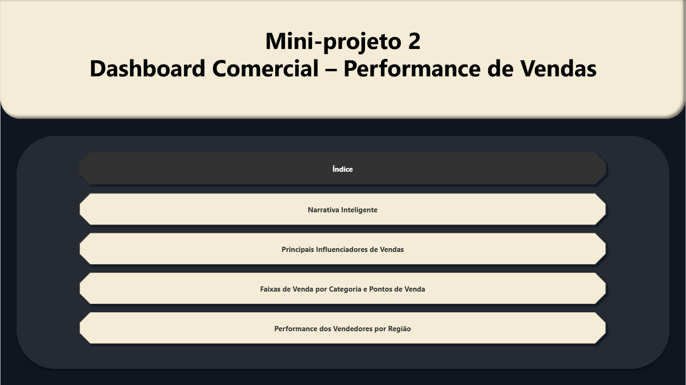
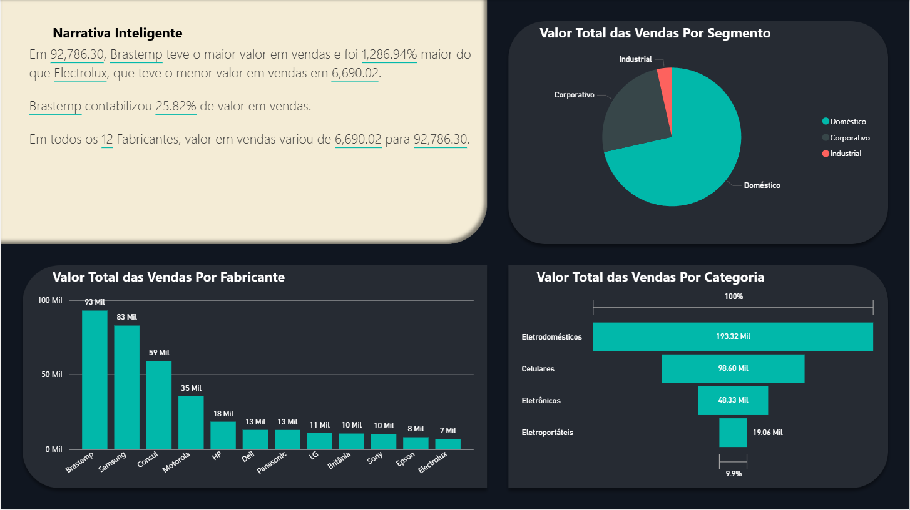
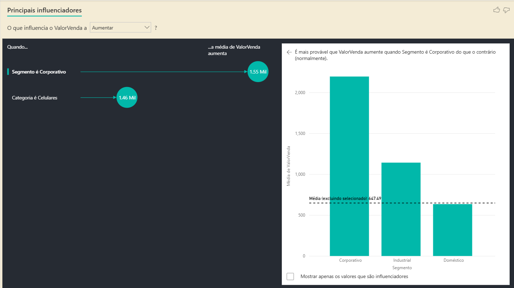
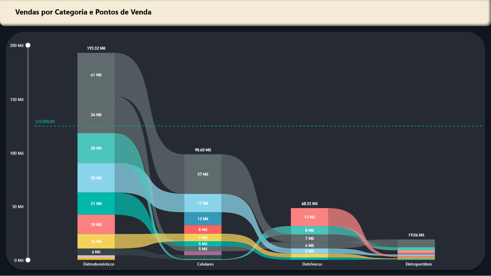
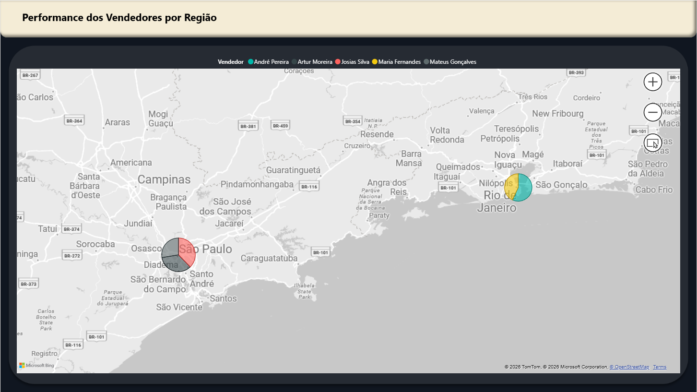

# :money_with_wings:Projeto Análise Comercial

 
  

> Projeto de análise de dados comerciais sobre Performance de Vendas de uma determinada empresa, sendo o foco deste projeto a Limpeza e Modelagem de dados, Inteligência Analítica, UX e UI

### :white_check_mark: Tecnologias e Ferramentas

- [x] Power BI
- [x] Power Query / M language
- [x] DAX

### :clipboard: Principais Características Técnicas

#### 1. Processamento de Dados (ETL)
> - Limpeza e tratamento de dados brutos utilizando o Power Query.
> - Padronização de tipos de dados e remoção de duplicatas/nulos.

#### 2. Inteligência Analítica (DAX)
> - Correção de tipo de dados das colunas.
> - Métricas dinâmicas para KPIs de performance.

#### 4. User Experience (UX) e Design
> - Navegação intuitiva através de um Índice.
> - Narrativa Inteligente que descreve as análises conforme mudanças ocorrem.
> - Principais influenciadores para responder perguntas e gerando insights com base em segmentos e categorias.

## :thought_balloon: Contatos

<a href="#" title="Gmail">
        
        
nicolasfelipecarvalho927@gmail.com

        </a>
    <a href="#" title="LinkedIn">
        
        
https://www.linkedin.com/in/nicolas-f-carvalho/

    </a>

